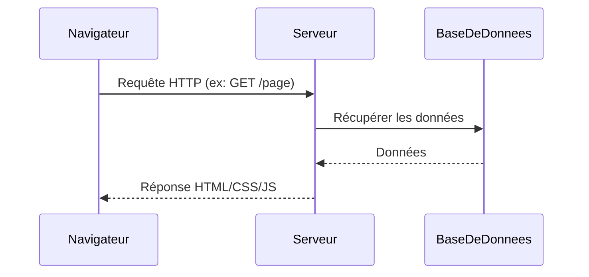

# Jour 2 — Comprendre l'ordinateur et le web

## Objectifs du jour

- Comprendre le fonctionnement d'un ordinateur
- Comprendre comment fonctionne le web
- Créer un compte GitHub

## Fonctionnement d'un ordinateur

Un ordinateur se compose de :

- **CPU** (processeur) — exécute les instructions
- **RAM** (mémoire vive) — stocke les données temporairement pendant l'exécution
- **Disque dur / SSD** — stockage permanent des fichiers
- **OS** (système d'exploitation) — Windows, macOS ou Linux ; gère le matériel

Le **terminal** communique directement avec l'OS via des commandes texte.

## Comment fonctionne le web

- **Client** : le navigateur (Chrome, Firefox…) affiche les pages
- **Serveur** : machine distante qui répond aux requêtes HTTP
- **HTTP/HTTPS** : protocole de communication web
- **URL** : adresse d'une ressource (ex: `https://github.com/Toneryhg/DevSetup`)

## Compte GitHub

GitHub est une plateforme d'hébergement de dépôts Git. Mon compte : **Toneryhg**.

Étapes de création :
1. Aller sur [github.com](https://github.com)
2. S'inscrire avec email et mot de passe
3. Vérifier l'adresse email
4. Configurer l'authentification (token ou SSH)

GitHub permet de :
- Héberger du code en ligne (public ou privé)
- Collaborer avec d'autres développeurs
- Suivre l'historique des modifications via Git

## Réflexion

Le web repose sur un modèle **client-serveur**. En tant que développeur, je vais
apprendre à créer à la fois le côté client (interfaces) et le côté serveur (API, logique).
